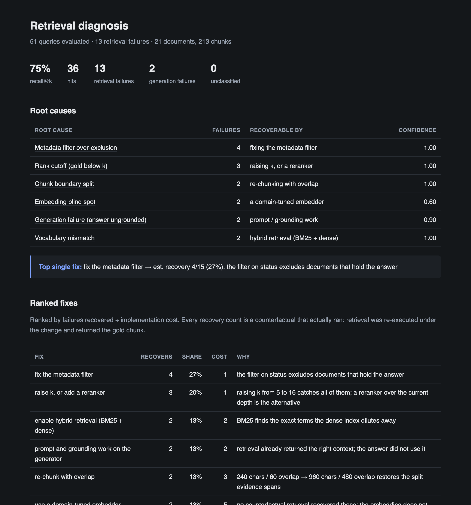

# ragdx — retrieval failure diagnostician

Most RAG evaluation tools give you a **score**. They tell you context precision is
0.61. They do not tell you *why* it is 0.61, or what to change on Monday.

`ragdx` gives you a **diagnosis**. For every query where retrieval failed it
identifies the root cause, clusters causes across the whole query set, and ranks
the config changes by how many failures each one would actually recover.

```
51 queries evaluated · 13 retrieval failures · recall@5 75%

  ROOT CAUSE                              FAILURES   RECOVERABLE BY
  ──────────────────────────────────────────────────────────────────────
  Metadata filter over-exclusion                 4   fixing the metadata filter
  Rank cutoff (gold below k)                     3   raising k, or a reranker
  Chunk boundary split                           2   re-chunking with overlap
  Embedding blind spot                           2   a domain-tuned embedder
  Generation failure (answer ungrounded)         2   prompt / grounding work
  Vocabulary mismatch                            2   hybrid retrieval (BM25 + dense)

  Top single fix: fix the metadata filter → est. recovery 4/15 (27%)
```



---

## How it works: differential diagnosis by ablation

`ragdx` does **not** ask an LLM why retrieval failed. LLM judges are biased and
unreliable, and a diagnostician that is confidently wrong is worse than no
diagnostician at all.

Instead it diagnoses the way a doctor rules out conditions: for every failed
query it **re-runs retrieval under a battery of counterfactuals** and sees which
one would have succeeded. The ablation that recovers the gold chunk names the
failure mode.

| Ablation | If the gold chunk comes back → | Recommended fix |
|---|---|---|
| Same retriever, deeper `k` | **Rank cutoff** — it was ranked, just too low | Raise `k`, or add a reranker |
| BM25 only, same `k` | **Vocabulary mismatch** — dense diluted the exact term | Hybrid retrieval |
| Dense only, same `k` | **Paraphrase gap** — the wording differed, the meaning did not | Hybrid retrieval |
| Filters removed | **Metadata filter failure** | Fix the filter |
| Larger, overlapping chunks | **Chunk boundary split** | Re-chunk with overlap |
| Nothing recovers it | **Embedding blind spot** | Domain-tuned embedder |
| Gold *was* retrieved, answer is wrong | **Generation failure**, not retrieval | Prompt / grounding work |

Almost every classification is arithmetic over ranks and set membership, not an
opinion. That is the whole trust argument. When nothing fits, `ragdx` reports
`unclassified` rather than guessing.

An LLM judge is used in exactly two places, and nowhere else: generating
synthetic goldens, and faithfulness scoring on the generation plane. Every
LLM-derived value carries a confidence and may abstain.

---

## Install

```bash
git clone https://github.com/RithikTheddu1999/ragdx.git
cd ragdx
uv sync                     # or: pip install -e .
```

Optional framework adapters:

```bash
pip install -e '.[langchain]'
pip install -e '.[llamaindex]'
```

The core package imports and runs with neither installed.

---

## Quickstart

### 1. Point ragdx at your corpus and your queries

Copy [`ragdx.example.yaml`](ragdx.example.yaml) to `ragdx.yaml` and edit the
paths. The minimum is a corpus directory and a golden set:

```yaml
corpus: ./docs
goldens: ./goldens.jsonl
retrieval:
  plane: dense
  k: 5
  filters:
    status: current
chunking:
  size: 240
  overlap: 60
```

### 2. Get a golden set

A golden is a query plus the **evidence span in the source document** that
answers it. Spans, not chunk ids — chunk ids are invalidated the moment you
re-chunk, which would make the chunking ablation impossible.

If you already have human labels, import them. Evidence may be quoted text; it
is resolved to a span, and a quote that matches nothing or matches twice is
rejected rather than guessed at:

```bash
ragdx goldens import --path labels.jsonl --corpus ./docs --out ./goldens
```

```json
{"golden_id": "g1", "query": "How long is a return label valid?",
 "doc_id": "returns-policy", "evidence": "valid for twenty eight days"}
```

Otherwise synthesize them. Each candidate is verified twice — answerable from
its own chunk, and *not* answerable from an unrelated one — and the rejection
rate is reported:

```bash
ragdx goldens build --corpus ./docs --n 50 --judge my_project.judges:my_judge
```

### 3. Run the diagnosis

```bash
ragdx run --config ragdx.yaml --out ./ragdx-report
```

You get `report.html` (self-contained, no network) and `report.json`.

---

## Connecting your own retrieval

### The zero-integration path: trace files

If ragdx cannot call your retriever, write down what it retrieved. Any stack
that can emit JSONL can be diagnosed:

```json
{"trace_id": "t1", "query": "How long is a return label valid?",
 "retrieved": [{"chunk": {"chunk_id": "c1", "doc_id": "returns-policy",
                          "text": "...", "char_start": 1200, "char_end": 1440},
                "score": 0.71, "rank": 0}],
 "answer": "Twenty eight days.",
 "config_snapshot": {"k": 5, "retriever": "dense", "filters": {"status": "current"}}}
```

```yaml
traces: ./traces.jsonl
```

Recordings support hit/miss scoring, clustering, the generation plane, and every
counterfactual that only needs your corpus — BM25, a dense index, re-chunking.
They cannot support retrieving deeper than the recording goes, or re-running
your retriever with the filter off; those ablations report themselves **skipped**
rather than pretending to have ruled anything out.

### Framework adapters

```python
from ragdx.adapters.langchain import LangChainRetrieverAdapter
from ragdx.corpus import load_corpus

retriever = LangChainRetrieverAdapter(my_retriever, docs=load_corpus(Path("./docs")))
```

`LlamaIndexRetrieverAdapter` is the same shape. Both need character offsets on
every chunk: put `char_start` / `char_end` in your metadata at index time
(LlamaIndex nodes already carry `start_char_idx` / `end_char_idx`), or pass
`docs=` and the adapter locates each chunk in its source document.

There are deliberately only two adapters. The trace-file path is the answer for
everything else.

---

## Determinism

Two runs on the same input produce byte-identical `report.json`. Embeddings are
derived by hashing, ranking ties break on chunk id, and every LLM call is cached
under a hash of its prompt so a rerun replays the first run's answers. There is
no timestamp in `report.json`, so a diff against a committed baseline shows only
what actually changed.

The whole test suite runs offline with no API keys.

---

## Limitations

Read this section before trusting a number.

- **Single-turn, single-retrieval only.** No agentic loops, no multi-hop, no
  query rewriting. If your system retrieves more than once per question, ragdx
  will diagnose whichever retrieval you record and silently ignore the rest.
- **Synthetic goldens are imperfect.** Verification removes the worst of them —
  questions answerable from anywhere in the corpus — but it cannot make a
  generated question *representative* of what your users actually ask. Human
  labels are better. Treat a synthetic-only failure rate as a smoke test, not a
  KPI.
- **Judge verdicts carry confidence and can abstain, and you should let them.**
  The faithfulness judge only runs where retrieval already succeeded, and
  anything short of a confident "ungrounded" leaves the query counted as a hit.
  That is deliberate: an unsure judge must never manufacture a failure. It also
  means generation failures are systematically **under**-reported.
- **`embedding_blind_spot` is the one non-deterministic call.** It is made from
  the score distribution when no ablation recovers the gold chunk, requires two
  independent signals to agree, and is reported at confidence 0.6. It is the
  cause most likely to be wrong. Precision/recall figures per cause are Phase 2
  (Milestone 12) and are not published yet — until they are, treat this label as
  a hint, not a finding.
- **Recovery counts are per-ablation, not additive across interacting fixes.**
  Each count says "this one change recovered these queries". Applying two fixes
  will not always recover the sum, because a query can have more than one thing
  wrong with it.
- **The rank-cutoff ablation refuses to run on small indexes.** If the deeper
  `k` approaches your index size, "raise k" stops being a shippable fix and
  ragdx skips the ablation rather than recommending it.
- **Chunk boundary detection depends on a coverage threshold** (default 0.75 of
  the evidence span in a single chunk). A span split 50/50 is a failure by this
  definition even though a generous reader might call it a partial hit.
- **`ragdx ci` is not implemented.** Phase 2.

---

## Development

```bash
uv sync
uv run pytest                # offline, no API keys
uv run pytest -m network     # integration tests against real frameworks
uv run ruff check . && uv run ruff format --check .
uv run mypy
```

The [fixture corpus](tests/fixtures/README.md) contains one deliberately planted
failure per mode, with ground truth authored from intent and confirmed by
primitive retrieval measurements — never by running the classifier. The
classifier is gated on reproducing it with ≥95% agreement and **zero** false
positives on the queries that work.

## Status

Phase 1 (developer diagnostic) is complete: golden sets, the ablation engine,
the classifier, the generation plane, clustering, ranked fixes and the report.

Phase 2 (CI regression gate: baselines, the gate, a GitHub Action, and a
published calibration report) is not started. See [PLAN.md](PLAN.md), which is
the specification this project is built against, including a log of every place
the implementation deviates from it and why.
